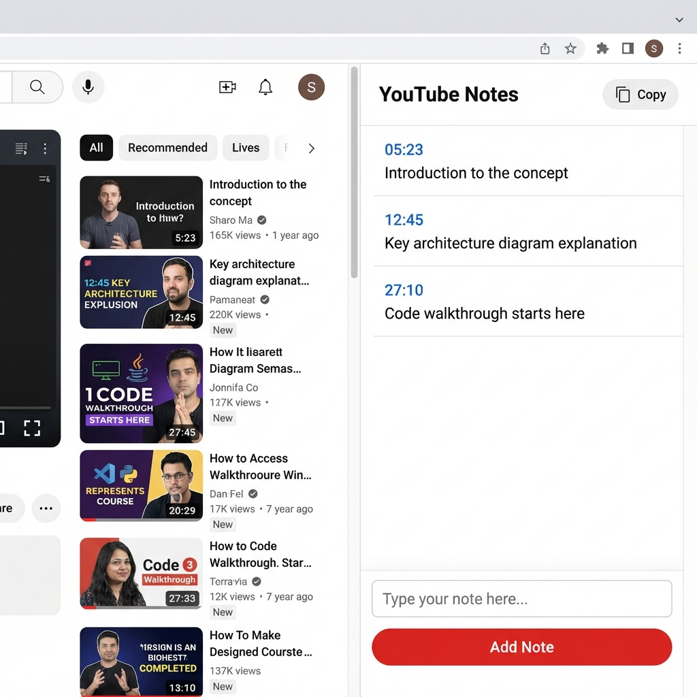

# YouTube Notes Chrome Extension

A Chrome extension that allows you to take timestamped notes while watching YouTube videos. Notes are saved locally and can be used to quickly navigate back to specific parts of the video.

## Features

- **Timestamped Notes**: Automatically captures the current video time when you add a note.
- **Click to Seek**: Click on any note's timestamp to jump the video to that exact moment.
- **Side Panel UI**: Integrated seamlessly into the Chrome Side Panel for a native look and feel.
- **YouTube Design**: Styled to match the YouTube aesthetic (Dark/Light mode compatible styles - *currently optimized for light mode*).
- **Rich Text Copy**: One-click button to copy all notes to your clipboard. Pasting into rich text editors (like Google Docs or Notion) preserves the timestamps as clickable YouTube links.
- **Keyboard Shortcuts**:
    - `Enter`: Add note.
    - `Cmd/Ctrl + Enter`: Add new line.
- **Persistence**: Notes are saved automatically per video using Chrome Storage.

## Installation

Since this extension is not yet in the Chrome Web Store, you need to load it manually:

1.  Clone or download this repository.
2.  Open Google Chrome and navigate to `chrome://extensions`.
3.  Enable **Developer mode** in the top right corner.
4.  Click **Load unpacked** in the top left.
5.  Select the directory containing this project (`youtube-notes-nov 2025`).

## Usage

1.  Open any YouTube video.
2.  Click the **Side Panel** icon in the Chrome toolbar (usually next to your profile picture).
3.  Select **YouTube Notes** from the dropdown menu.
4.  Type your note and press `Enter` or click "Add Note".
5.  Click the **Copy** button to copy all notes with hyperlinks.

## Technologies

- **Manifest V3**: The latest Chrome Extension platform version.
- **Side Panel API**: For the user interface.
- **Scripting API**: For dynamic content script injection.
- **Chrome Storage API**: For saving notes locally.

Author Note:
The entire codebase (including the Readme file) is generated by AI. 
